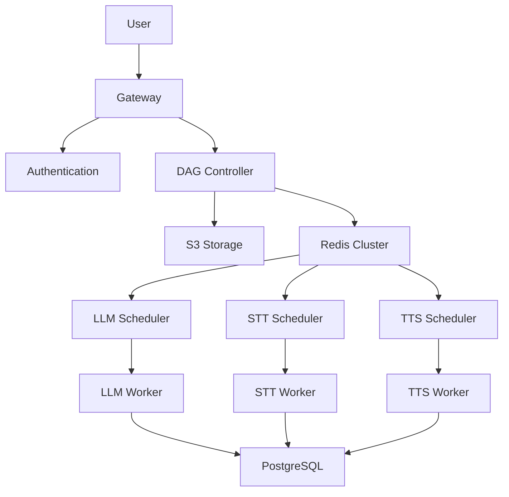

# Labubu AI Creative Platform | Labubu AI 云创平台

**[English](#english) | [中文](#chinese)**

---

## English

### 🎨 Project Overview

**Labubu AI Creative Platform** is an innovative AI agent building platform leveraging Kubernetes for scalable microservices architecture. Inspired by the popular Labubu designer toy, this platform enables users to create custom AI agents for virtual character customization through multimodal services (LLM, TTS, STT, image/text conversion).

### 🏗️ Project Structure

#### Frontend
```
Frontend/
├── public/                     # Static public assets
├── src/                        # Source code
│   ├── assets/                 # Static assets
│   ├── components/             # Vue components
│   ├── App.vue                 # Main application component 
│   └── main.js                 # Application entry point 
├── index.html                  # HTML template 
└── package.json                # Dependencies and scripts
```

#### Backend (Kubernetes Microservices)
```
Backend/
├── ai-agent-ingress/           # API gateway ingress
├── dependency/                 # Service dependencies
├── login/                      # Authentication service
├── microservice-*/             # AI processing services
│   ├── main/
│   │   ├── *-deployment.yaml   # K8s deployment
│   │   └── *-service.yaml      # K8s service
├── scheduler/                  # Task schedulers
│   ├── main/
│   │   ├── scheduler-*-deployment.yaml
│   │   └── scheduler-*-hpa.yaml
├── postgres/                   # Database
├── redis/                      # Redis cluster
├── secret/                     # Secret management
└── system/                     # System components
```

### ⚙️ Core Technologies

#### Kubernetes Architecture
- **Service Mesh**: Gateway handles authentication and routing
- **Auto-scaling**: HPA configurations for dynamic resource allocation
- **Service Discovery**: Built-in Kubernetes DNS for inter-service communication
- **Persistent Storage**: PostgreSQL for metadata, S3 for large files

#### AI Processing Services
| Service       | Functionality                          | Technology               |
|---------------|----------------------------------------|--------------------------|
| LLM           | Language processing                    | Gemini API               |
| STT           | Speech-to-text conversion              | Google Cloud Speech API  |
| TTS           | Text-to-speech synthesis               | Google Cloud Text-to-Speech |
| PIC2TEXT      | Image description generation           | BLIP model               |
| TEXT2PIC      | Text-to-image generation               | Stable Diffusion         |

#### Scheduling System
```go
// Weighted Fair Queuing Algorithm
VFT = math.Max(globalVT, tenantVT) + (1.0 / weight)
```
- **Virtual Finish Time (VFT)**: Ensures fair resource allocation
- **Dual Token Bucket**: Controls concurrency and QPS limits
- **Priority Queues**: ZSET-based queues in Redis for each service type

### 🚀 Key Features

1. **Distributed DAG Processing**
   - Visual workflow definition for AI tasks
   - Automatic dependency resolution
   - Parallel execution of independent nodes

2. **Dynamic Resource Allocation**
   ```yaml
   # Example HPA configuration
   apiVersion: autoscaling/v2
   kind: HorizontalPodAutoscaler
   spec:
     metrics:
     - type: Resource
       resource:
         name: cpu
         target:
           type: Utilization
           averageUtilization: 80
   ```

3. **Multimodal AI Services**
   - Seamless integration of 5 AI capabilities
   - Unified API interface for service orchestration
   - Presigned S3 URLs for secure data transfer

4. **Tenant Isolation**
   - Resource quotas per tenant
   - Isolated virtual timelines (VFT)
   - Weight-based priority scheduling

5. **Real-time Monitoring**
   - SSE for DAG status updates
   - Redis Pub/Sub for event notifications
   - End-to-end execution tracking

### 🌐 System Architecture



### 🛠️ Tech Stack

**Infrastructure**
- Kubernetes v1.27
- AWS S3 for object storage
- Redis Cluster for state management
- PostgreSQL for metadata storage
- Nginx Ingress Controller

**Backend Services**
- Go 1.20 (microservices)
- AWS SDK for S3 integration
- go-redis for Redis operations
- Docker for containerization

**AI Services**
- Google Gemini API
- Stable Diffusion XL
- BLIP-2 model
- Google Cloud Speech-to-Text
- Google Cloud Text-to-Speech

### 🚀 Quick Start

**Prerequisites:**
- Kubernetes cluster
- Helm v3.8+
- AWS S3 bucket
- Google Cloud credentials

**Deployment Steps:**
1. Configure secrets:
   ```bash
   kubectl apply -f backend/secret/
   ```

2. Deploy databases:
   ```bash
   kubectl apply -f backend/postgres/
   kubectl apply -f backend/redis/
   ```

3. Deploy microservices:
   ```bash
   kubectl apply -f backend/microservice-*/
   ```

4. Deploy schedulers:
   ```bash
   kubectl apply -f backend/scheduler/
   ```

5. Deploy ingress:
   ```bash
   kubectl apply -f backend/ai-agent-ingress/
   ```

### 💡 System Advantages

1. **Elastic Scaling**
   - Automatic pod scaling based on queue length
   - Efficient resource utilization during peak loads

2. **High Availability**
   - Redis cluster with automatic failover
   - PostgreSQL replication
   - Kubernetes self-healing capabilities

3. **Fair Scheduling**
   - WFQ algorithm ensures tenant fairness
   - Dynamic priority adjustment
   - Resource isolation between tenants

4. **Unified API Gateway**
   - JWT-based authentication
   - Rate limiting
   - Request routing and load balancing

5. **End-to-End Pipeline**
   - Seamless data flow through S3 presigned URLs
   - Atomic operation tracking
   - Comprehensive status monitoring

---

## Chinese

### 🎨 项目概述

**Labubu AI 云创平台** 是基于 Kubernetes 的创新型 AI 代理构建平台。受流行 Labubu 设计师玩具启发，该平台通过多模态服务（LLM、TTS、STT、图像/文本转换）使用户能够创建自定义 AI 代理，实现虚拟角色定制。

### 🏗️ 项目结构

#### 前端
```
Frontend/
├── public/                     # 静态公共资源
├── src/                        # 源代码
│   ├── assets/                 # 静态资源
│   ├── components/             # Vue组件
│   ├── App.vue                 # 主应用组件
│   └── main.js                 # 应用入口点
├── index.html                  # HTML模板
└── package.json                # 依赖和脚本
```

#### 后端 (Kubernetes 微服务)
```
Backend/
├── ai-agent-ingress/           # API 网关入口
├── dependency/                 # 服务依赖
├── login/                      # 认证服务
├── microservice-*/             # AI处理服务
│   ├── main/
│   │   ├── *-deployment.yaml   # K8s部署配置
│   │   └── *-service.yaml      # K8s服务配置
├── scheduler/                  # 任务调度器
│   ├── main/
│   │   ├── scheduler-*-deployment.yaml
│   │   └── scheduler-*-hpa.yaml
├── postgres/                   # 数据库
├── redis/                      # Redis集群
├── secret/                     # 密钥管理
└── system/                     # 系统组件
```

### ⚙️ 核心技术

#### Kubernetes 架构
- **服务网格**：网关处理认证和路由
- **自动扩缩容**：HPA 配置实现动态资源分配
- **服务发现**：内置 Kubernetes DNS 用于服务间通信
- **持久化存储**：PostgreSQL 存储元数据，S3 存储大文件

#### AI 处理服务
| 服务          | 功能                          | 技术                     |
|---------------|-------------------------------|--------------------------|
| LLM           | 语言处理                      | Gemini API               |
| STT           | 语音转文本                    | Google 语音识别 API      |
| TTS           | 文本转语音                    | Google 文本转语音 API    |
| PIC2TEXT      | 图像描述生成                  | BLIP 模型                |
| TEXT2PIC      | 文本生成图像                  | Stable Diffusion         |

#### 调度系统
```go
// 加权公平排队算法
VFT = math.Max(globalVT, tenantVT) + (1.0 / weight)
```
- **虚拟完成时间 (VFT)**：确保资源公平分配
- **双令牌桶**：控制并发和 QPS 限制
- **优先级队列**：基于 Redis ZSET 的服务类型队列

### 🚀 核心功能

1. **分布式 DAG 处理**
   - 可视化 AI 任务工作流定义
   - 自动依赖关系解析
   - 并行执行独立节点

2. **动态资源分配**
   ```yaml
   # HPA 配置示例
   apiVersion: autoscaling/v2
   kind: HorizontalPodAutoscaler
   spec:
     metrics:
     - type: Resource
       resource:
         name: cpu
         target:
           type: Utilization
           averageUtilization: 80
   ```

3. **多模态 AI 服务**
   - 无缝集成 5 种 AI 能力
   - 统一 API 接口用于服务编排
   - S3 预签名 URL 保障安全数据传输

4. **租户隔离**
   - 按租户分配资源配额
   - 隔离的虚拟时间线 (VFT)
   - 基于权重的优先级调度

5. **实时监控**
   - SSE 实时更新 DAG 状态
   - Redis Pub/Sub 事件通知
   - 端到端执行追踪

### 🌐 系统架构


### 🛠️ 技术栈

**基础设施**
- Kubernetes v1.27
- AWS S3 对象存储
- Redis 集群状态管理
- PostgreSQL 元数据存储
- Nginx 入口控制器

**后端服务**
- Go 1.20 (微服务)
- AWS SDK S3 集成
- go-redis Redis 操作
- Docker 容器化

**AI 服务**
- Google Gemini API
- Stable Diffusion XL
- BLIP-2 模型
- Google 语音转文本
- Google 文本转语音

### 🚀 快速开始

**先决条件:**
- Kubernetes 集群
- Helm v3.8+
- AWS S3 存储桶
- Google Cloud 凭证

**部署步骤:**
1. 配置密钥:
   ```bash
   kubectl apply -f backend/secret/
   ```

2. 部署数据库:
   ```bash
   kubectl apply -f backend/postgres/
   kubectl apply -f backend/redis/
   ```

3. 部署微服务:
   ```bash
   kubectl apply -f backend/microservice-*/
   ```

4. 部署调度器:
   ```bash
   kubectl apply -f backend/scheduler/
   ```

5. 部署入口:
   ```bash
   kubectl apply -f backend/ai-agent-ingress/
   ```

### 💡 系统优势

1. **弹性伸缩**
   - 基于队列长度的自动 Pod 扩缩容
   - 高峰负载时高效资源利用

2. **高可用性**
   - 自动故障转移的 Redis 集群
   - PostgreSQL 复制
   - Kubernetes 自愈能力

3. **公平调度**
   - WFQ 算法确保租户公平性
   - 动态优先级调整
   - 租户间资源隔离

4. **统一 API 网关**
   - JWT 认证
   - 速率限制
   - 请求路由和负载均衡

5. **端到端流水线**
   - 通过 S3 预签名 URL 实现无缝数据流
   - 原子操作追踪
   - 全面的状态监控

---

### 📝 Project Notes | 项目说明

**English**: Labubu AI leverages Kubernetes for scalable AI service orchestration with advanced scheduling algorithms.

**中文**: Labubu AI 利用 Kubernetes 实现可扩展的 AI 服务编排，采用先进的调度算法。

### 🔗 Repository | 仓库链接

GitHub: [https://github.com/ENFJ-Meower/Labubu-Remake-AI-Platform](https://github.com/ENFJ-Meower/Labubu-Remake-AI-Platform)

### 📄 License | 许可证

MIT License - see LICENSE file for details.

---

**Last Updated**: 2025-07-18 | **最后更新**: 2025-07-18

---

### 📋 Change Log | 更新日志

**2025-07-18 v1.0**
- **Kubernetes Integration**: Full Kubernetes deployment for all microservices
- **WFQ Scheduler**: Implemented Weighted Fair Queuing algorithm
- **Dual Token Bucket**: Added concurrency and QPS control system
- **Redis Cluster**: State management with auto-failover
- **S3 Integration**: Secure file transfer with presigned URLs
- **Multi-service Architecture**: LLM, STT, TTS, PIC2TEXT, TEXT2PIC services

**2025-07-18 v1.0**
- **Kubernetes 集成**: 所有微服务的完整 Kubernetes 部署
- **WFQ 调度器**: 实现加权公平排队算法
- **双令牌桶**: 新增并发和 QPS 控制系统
- **Redis 集群**: 带自动故障转移的状态管理
- **S3 集成**: 通过预签名 URL 实现安全文件传输
- **多服务架构**: LLM, STT, TTS, PIC2TEXT, TEXT2PIC 服务